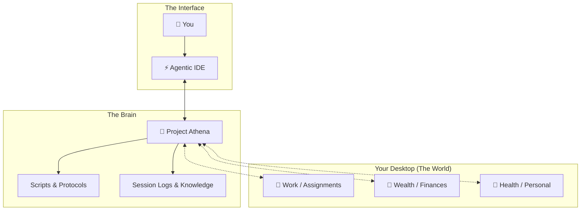
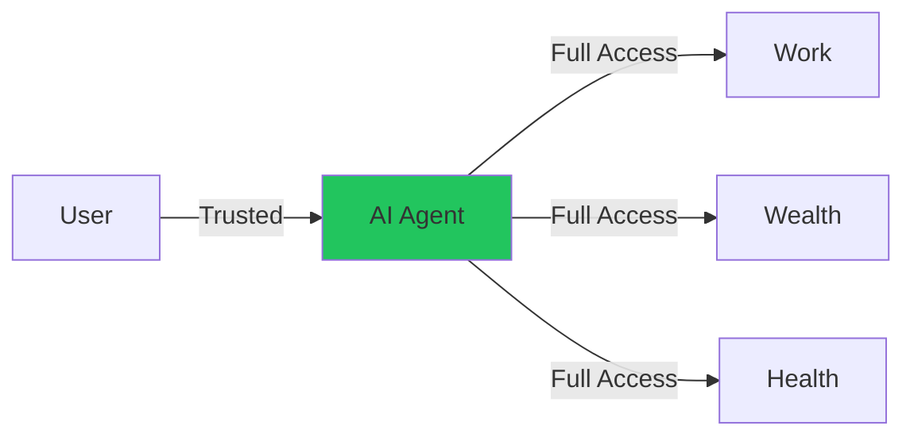
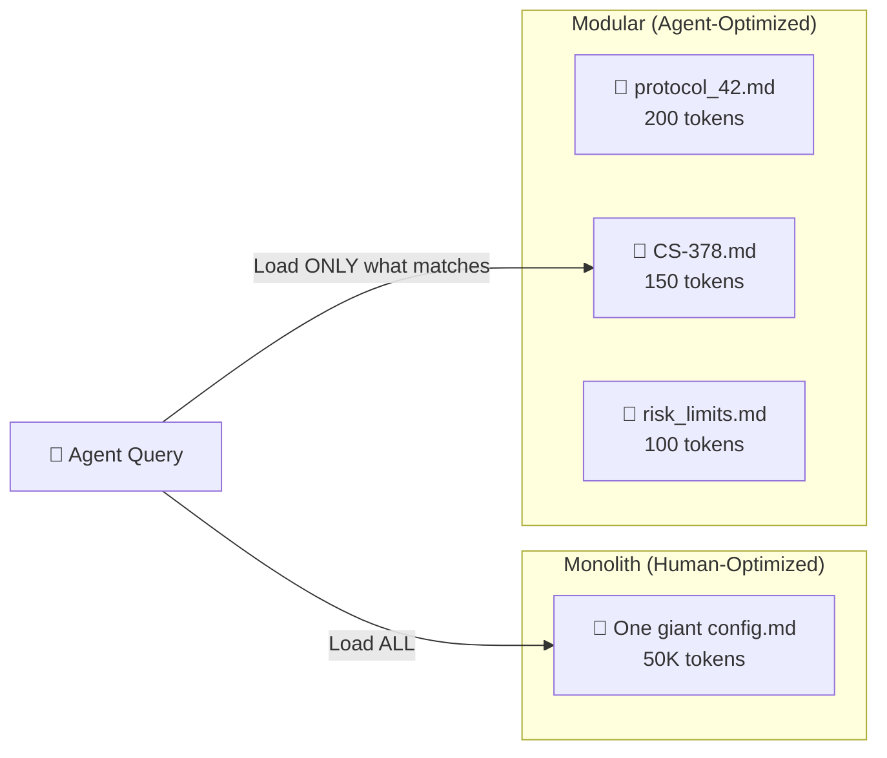

## Concept

**Athena is not just a coding assistant. It is a Centralized HQ for your entire life**—a "second brain" (exocortex) that manages external domains from a single command center.

<Note>
**Exocortex** (external cortex) — An information processing system that exists outside the biological brain but functions as an extension of cognition and memory.
</Note>

## Architecture Philosophy



### Key Concepts

| Component | Role | Analogy |
|-----------|------|----------|
| **Project Athena** | The Kernel — holds logic, memory, and laws | The Brain |
| **External Folders** | The Database — holds raw assets (files, docs) | The Body |
| **Agentic IDE** | The Console — provides compute and interface | The Nervous System |
| **You** | The Pilot — issues commands and makes decisions | The Consciousness |

## Mount Points (The "Body" Parts)

To enable Athena to manage your life, you define **Mount Points**—aliases to external folders that exist *outside* the Athena directory:

```python
# In src/athena/boot/constants.py
MOUNTS = {
    "WORK": "/Users/you/Desktop/Assignments",
    "WEALTH": "/Users/you/Desktop/Wealth",
    "HEALTH": "/Users/you/Desktop/Health"
}
```

**Why Separate?**

This separation protects your user data from system updates. If Athena's code is reset or reinstalled, your Health records remain safe in their own folder.

### Example Use Cases

**Work Domain:**

```bash
# Athena can now access your work assignments
"Read the latest assignment from WORK/CS231N/Assignment3.pdf"
"Generate a summary of all pending tasks in WORK/"
```

**Wealth Domain:**

```bash
# Athena can analyze your finances
"What's my current portfolio allocation in WEALTH/Investments/?"
"Run a risk analysis on my trading positions"
```

**Health Domain:**

```bash
# Athena can track your personal data
"Log today's workout to HEALTH/Fitness/journal.md"
"Analyze my sleep patterns from the last 30 days"
```

## Required IDE Settings

To achieve "Total Life OS" functionality, the Agentic IDE must have elevated permissions:

| Setting | Value | Purpose |
|---------|-------|----------|
| **Non-Workspace File Access** | `Enabled` | Allows Athena to reach folders outside its root |
| **Terminal Auto Execution** | `Always Proceed` (optional) | Enables autonomous script execution |
| **Secure Mode** | `Disabled` | Removes friction for trusted environments |

<Warning>
**This is "God Mode".** It is powerful but requires trust.

**Only enable in a personal, secure environment.**

An AI that manages your entire life MUST have access to your entire life—there is no way to sandbox an agent while simultaneously granting full autonomy.
</Warning>

## The Trade-Off: Power vs. Safety

### Traditional Approach


**Pros:** Safe, can't access sensitive files  
**Cons:** Can't manage your life—only your code

### Exocortex Approach



**Pros:** Total Life OS—AI as sovereign operating system  
**Cons:** Requires absolute trust in the AI and the agentic IDE

## Safety Mitigations

Instead of locking permissions, lock the **process**:

### 1. Quicksave Before Dangerous Operations

```python
# Before modifying critical files
quicksave("About to modify trading config")
# Modify files...
quicksave("Trading config updated successfully")
```

Every state change is checkpointed. If something breaks, you can trace the exact moment it happened.

### 2. Deny List for Catastrophic Commands

```python
DANGEROUS_COMMANDS = [
    "rm -rf /",
    "sudo rm",
    "dd if=/dev/zero",
    ":(){ :|:& };:"  # Fork bomb
]

def execute_command(cmd: str):
    if any(pattern in cmd for pattern in DANGEROUS_COMMANDS):
        raise SecurityError("Catastrophic command blocked")
    # Execute...
```

### 3. Git Commit on Every `/end` Session

```bash
# At end of every session
/end
# Automatically triggers:
# - Finalize session log
# - Run orphan detector
# - Git commit all changes
```

Full version control history means you can roll back any mistake.

### 4. Audit Trail

Every file access, tool call, and permission check is logged:

```json
{
  "timestamp": "2026-03-03T10:30:00",
  "action": "read_file",
  "target": "/Users/you/WEALTH/portfolio.json",
  "outcome": "allowed"
}
```

If something goes wrong, you have a complete forensic trail.

## Design Principle: Modular > Monolith

<Note>
**Core thesis:** AI agents don't read files sequentially—they **query** them.

A workspace optimized for agents should be a **graph of small, addressable nodes**, not a monolithic document.
</Note>

### Why Fragmentation Works

Athena deliberately fragments its knowledge across hundreds of Markdown files and Python scripts. This looks unusual to humans—but it is **optimal for AI agents** operating under context window constraints.



### The Five Advantages

| # | Principle | Monolith | Modular |
|:-:|:----------|:---------|:--------|
| 1 | **Context Efficiency** | Loads 50K tokens even when 200 are relevant | Loads only the files the query demands (JIT) |
| 2 | **Addressability** | "See page 47"—no agent can do this | `CS-378-prompt-arbitrage.md`—retrievable by name, tag, or semantic search |
| 3 | **Zero Coupling** | Editing marketing section risks breaking trading rules | Each file is independent—change one, break nothing |
| 4 | **Version Control** | One-line change → 50K-token diff | Atomic commits per file with clean history |
| 5 | **Composability** | Can't mix-and-match sections at runtime | Swarms, workflows, and skills load as independent Lego bricks |

## Human UX vs Agent UX

The key insight is that **humans and AI agents navigate knowledge differently**:

| Dimension | Human | AI Agent |
|:----------|:------|:---------|
| **Navigation** | Read sequentially (top → bottom) | Query by filename, tag, or embedding similarity |
| **"Organized" feels like** | One well-structured document | Many small, well-named files |
| **Index** | Table of contents | File system + TAG_INDEX + vector embeddings |
| **Retrieval** | Ctrl+F / scroll | Semantic search + RRF fusion |

A single README feels "organized" to a human. But to an agent, **the file system IS the database**:

- Each `.md` file is a **row**
- The filename is the **primary key**
- Cross-references are **foreign keys**

## How Athena Exploits This

### 1. Boot at ~10K Tokens

`/start` loads only:

- `Core_Identity.md`
- `activeContext.md`
- Session recall

The remaining **190K tokens** of context window stay free.

### 2. On-Demand Loading

When you ask about trading, `risk_limits.md` loads. When you ask about architecture, `System_Manifest.md` loads. Neither pollutes the other's context.

### 3. Semantic Search Navigates the Graph

`smart_search.py` uses hybrid RAG (keyword + embeddings + reranking) to find the right file across hundreds of nodes in milliseconds.

### 4. Protocols are Composable

A Marketing Swarm loads:

- `script_writer.md`
- `ad_designer.md`

Without touching the trading or psychology stacks.

<Note>
The workspace is not a codebase. It's an **exocortex**—a knowledge graph stored as flat files, navigable by any agent that can read Markdown.
</Note>

## Directory Structure

See the full architecture in [ARCHITECTURE.md](https://github.com/winstonkoh87/athena-public/blob/main/docs/ARCHITECTURE.md).

**Key Directories:**

```text
Athena/
├── .framework/       # The Codex (stable, rarely updated)
├── .context/         # User-specific data (frequently updated)
├── .agent/           # Agent configuration (skills, workflows, scripts)
├── src/              # Python SDK source
└── User_Vault/       # Personal vault (credentials, secrets)
```

**External Mount Points:**

```text
~/Desktop/
├── Assignments/      # WORK mount point
├── Wealth/           # WEALTH mount point
└── Health/           # HEALTH mount point
```

## Implementation Reference

See `docs/ARCHITECTURE.md:317` for the complete exocortex model documentation and `src/athena/boot/constants.py` for mount point configuration.

## Next Steps

<CardGroup cols={2}>
  <Card title="Getting Started" icon="rocket" href="/getting-started">
    Set up your first Athena workspace
  </Card>
  <Card title="Security Model" icon="shield" href="/advanced/security">
    Understand agentic safety and permissions
  </Card>
</CardGroup>