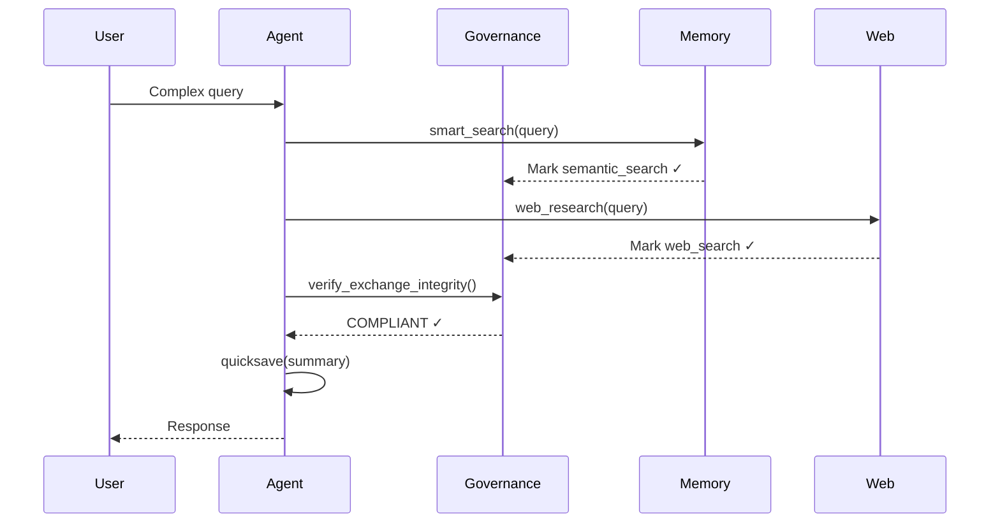

## Overview

The Governance Engine enforces Athena's **Triple-Lock protocol** to ensure all AI interactions are properly grounded before checkpointing. It also includes **Doom Loop Detection** to prevent infinite retry loops that waste tokens.

## Triple-Lock Protocol

The Triple-Lock protocol mandates:

1. **Semantic Search** — Query internal knowledge base
2. **Web Research** — Consult external sources
3. **Quicksave** — Checkpoint findings to session log

This ensures every response is grounded in both internal memory and external validation.



## Risk-Proportional Enforcement

Version 9.x introduced **Risk-Proportional Triple-Lock** based on query complexity:

### Risk Levels

```python
class RiskLevel(IntEnum):
    SNIPER = 0    # Λ < 10  — Triple-Lock EXEMPT
    STANDARD = 1  # Λ 10-30 — Full Triple-Lock enforced
    ULTRA = 2     # Λ > 30  — Full Triple-Lock + extended compute
```

| Level | Latency | Examples | Triple-Lock |
|-------|---------|----------|-------------|
| **SNIPER** | < 10 | Factual retrieval, formatting, simple Q&A | ❌ Exempt |
| **STANDARD** | 10-30 | Analysis, explanation, code generation | ✅ Required |
| **ULTRA** | > 30 | Strategy, architecture, trading decisions | ✅ Required + Extended |

### Robustness Bias

<Warning>
**Default is STANDARD.** Only classify as SNIPER when you are CERTAIN the query is low-risk.

**Design principle:** `cost(under-processing) >> cost(over-processing)`

When uncertain, bias toward higher risk classification.
</Warning>

### Setting Risk Level

```python
from athena.core.governance import get_governance, RiskLevel

gov = get_governance()

# Simple factual query (low-risk)
gov.set_risk_level(RiskLevel.SNIPER)
# Triple-Lock exempt — direct answer allowed

# Complex analysis (standard)
gov.set_risk_level(RiskLevel.STANDARD)
# Full Triple-Lock enforced

# Strategic decision (high-risk)
gov.set_risk_level(RiskLevel.ULTRA)
# Full Triple-Lock + Triple Crown reasoning
```

## Doom Loop Detection

Stolen from [OpenCode](https://github.com/anomalyco/opencode) (109K stars), integrated February 2026.

### What is a Doom Loop?

An infinite retry loop where the same tool call is repeated with identical arguments, burning tokens without making progress.

**Example:**

```python
# Attempt 1: smart_search("trading protocols")
# Attempt 2: smart_search("trading protocols")  # Same args
# Attempt 3: smart_search("trading protocols")  # 🔴 DOOM LOOP
```

### Detection Algorithm

```python
class DoomLoopDetector:
    def record(self, tool_name: str, args: Any) -> bool:
        """Returns True if doom loop detected."""
        # Create deterministic hash of arguments
        args_hash = hashlib.sha256(
            json.dumps(args, sort_keys=True).encode()
        ).hexdigest()[:16]
        
        signature = f"{tool_name}:{args_hash}"
        
        # Count occurrences within 60s window
        count = sum(
            1 for entry in self._history 
            if entry["signature"] == signature
        )
        
        if count >= 3:  # Threshold
            logger.warning("🔴 DOOM LOOP DETECTED")
            return True
        
        return False
```

### Configuration

```python
DOOM_LOOP_THRESHOLD = 3   # Repetitions before flagging
DOOM_LOOP_WINDOW = 60     # Seconds (time window)
```

<Note>
Doom Loop Detection is a **circuit breaker** for token-burning agentic failures. It logs warnings but does NOT block execution—human oversight required.
</Note>

## Governance API

### Verify Exchange Integrity

```python
from athena.core.governance import get_governance

gov = get_governance()

# Check if Triple-Lock was followed
is_compliant = gov.verify_exchange_integrity()
# Returns: True if semantic + web search performed (or Sniper mode)
```

### Mark Search Operations

```python
# Mark semantic search performed
gov.mark_search_performed("trading risk protocols")

# Mark web search performed  
gov.mark_web_search_performed("latest trading regulations")
```

### Get Integrity Score

```python
score = gov.get_integrity_score()
# Returns: 1.0 if compliant, 0.0 if missing steps
```

### Record Tool Calls

```python
# Record tool call for doom loop detection
is_loop = gov.record_tool_call("smart_search", {"query": "test"})

if is_loop:
    logger.warning("Infinite loop detected — aborting")
```

## Governance Status

Check full governance state via MCP tool:

```python
status = governance_status()
```

**Returns:**

```json
{
  "triple_lock": {
    "semantic_search": true,
    "web_search": true,
    "integrity_score": 1.0,
    "risk_level": "STANDARD",
    "sniper_mode": false
  },
  "doom_loop": {
    "total_violations": 0,
    "history_size": 5,
    "threshold": 3,
    "window_seconds": 60
  }
}
```

## State Persistence

Governance state is saved to `.agent/state/exchange_state.json`:

```json
{
  "semantic_search_performed": true,
  "web_search_performed": true,
  "last_search_time": 1709467200
}
```

**State is reset after each `verify_exchange_integrity()` call** to prepare for the next exchange.

## Integration with MCP Tools

All MCP tools automatically integrate with governance:

```python
@mcp.tool(tags={"write", "session"})
def quicksave(summary: str, bullets: list[str] = None):
    # Check Triple-Lock compliance
    gov = get_governance()
    semantic = gov._state.get("semantic_search_performed", False)
    web = gov._state.get("web_search_performed", False)
    
    if not (semantic and web):
        violation = f"TRIPLE-LOCK VIOLATION: Missing steps"
    
    gov.verify_exchange_integrity()  # Reset state
    
    return {
        "status": "ok",
        "governance": violation or "COMPLIANT"
    }
```

See `src/athena/mcp_server.py:199` for the quicksave implementation.

## Design Philosophy

### Why Triple-Lock?

**Problem:** AI hallucinations and outdated training data lead to incorrect responses.

**Solution:** Force dual-source grounding:

1. **Internal Memory** (Semantic Search) — Your documented knowledge
2. **External Validation** (Web Research) — Current information

This creates a **bilateral validation loop** that catches both:

- **Internal blind spots** — Missing context in your knowledge base
- **External drift** — Training data that's stale or incorrect

### Why Risk-Proportional?

**Problem:** Not all queries need the same rigor. "What's the time?" shouldn't require semantic search.

**Solution:** Classify by complexity (Latency Score Λ):

- Simple queries (Λ < 10) → Direct answer (Sniper Mode)
- Complex queries (Λ ≥ 10) → Full grounding (Standard/Ultra)

### Why Doom Loop Detection?

**Problem:** Agentic systems can enter infinite retry loops when tool calls fail, burning thousands of tokens.

**Solution:** Detect identical repeated calls and log warnings. Human can intervene or system can abort.

## Implementation Reference

See `src/athena/core/governance.py:156` for the `GovernanceEngine` class and `src/athena/core/governance.py:67` for the `DoomLoopDetector` implementation.

## Next Steps

<CardGroup cols={2}>
  <Card title="Security Model" icon="shield" href="/advanced/security">
    Learn about permissioning and secret mode
  </Card>
  <Card title="Exocortex Model" icon="brain" href="/advanced/exocortex-model">
    Understand the Total Life OS architecture
  </Card>
</CardGroup>