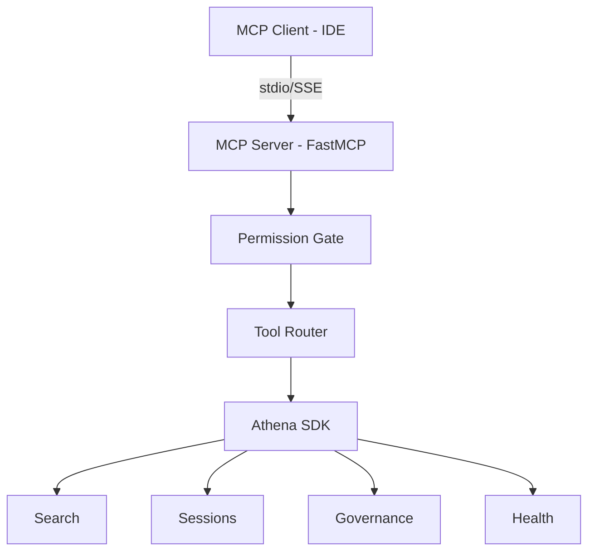

## Overview

The MCP Server exposes Athena's core capabilities as standardized [Model Context Protocol](https://modelcontextprotocol.io/) tools, making them consumable by any MCP-compatible client including Antigravity, Claude Desktop, Cursor, and other agentic IDEs.

## Quick Start

### stdio Transport (IDE Integration)

For local IDE integration using standard input/output:

```bash
python -m athena.mcp_server
```

### SSE Transport (Remote Access)

For remote or multi-client access using Server-Sent Events:

```bash
python -m athena.mcp_server --sse --port 8765
```

### IDE Configuration

Add Athena to your IDE's MCP settings (e.g., `.agent/mcp_config.json`):

```json
{
  "mcpServers": {
    "athena": {
      "command": "python",
      "args": ["-m", "athena.mcp_server"],
      "cwd": "/path/to/your/athena/workspace"
    }
  }
}
```

## Available Tools

The MCP server exposes 8 tools, each gated by the Permissioning Layer:

| Tool | Permission | Sensitivity | Description |
|------|-----------|-------------|-------------|
| `smart_search` | read | internal | Hybrid RAG search with RRF fusion |
| `quicksave` | write | internal | Save timestamped checkpoint to session log |
| `health_check` | read | public | Audit Vector API and Database subsystems |
| `recall_session` | read | internal | Retrieve recent session log content |
| `governance_status` | read | internal | Check Triple-Lock compliance state |
| `list_memory_paths` | read | public | List active memory directories |
| `set_secret_mode` | admin | — | Toggle demo/external mode |
| `permission_status` | read | — | Show permission state and tool manifest |

### smart_search

Hybrid RAG search combining Canonical Memory, Tags, Vectors, GraphRAG, and filenames:

```python
result = smart_search(
    query="trading risk protocols",
    limit=10,
    strict=False,  # Filter low-confidence results
    rerank=False   # Apply LLM-based reranking
)
```

**Returns:**
```json
{
  "results": [...],
  "meta": {
    "query": "trading risk protocols",
    "limit": 10,
    "timestamp": "2026-03-03T10:30:00"
  }
}
```

### quicksave

Save a checkpoint to the current session log:

```python
quicksave(
    summary="Implemented MCP server integration",
    bullets=[
        "Added 8 MCP tools with permission gates",
        "Configured stdio and SSE transports",
        "Integrated Triple-Lock governance"
    ]
)
```

<Note>
The quicksave tool automatically checks Triple-Lock compliance and includes governance status in the response.
</Note>

### health_check

Run a health audit of core services:

```python
status = health_check()
# Returns: {"vector_api": {...}, "database": {...}, "overall": "PASS"}
```

## Resources

The server exposes 2 resources accessible via URI:

| URI | Description |
|-----|-------------|
| `athena://session/current` | Full content of active session log |
| `athena://memory/canonical` | Canonical Memory (CANONICAL.md) |

## Permissioning Layer

All tools are gated by the Permission Engine (see [Security](/advanced/security) for details).

### Capability Tokens

4 escalating permission levels:

| Level | Access | Example Tools |
|-------|--------|---------------|
| `read` | Query/read data | `smart_search`, `recall_session` |
| `write` | Modify session logs | `quicksave` |
| `admin` | Modify config, toggle modes | `set_secret_mode` |
| `dangerous` | Delete data (future, unused) | — |

**Default caller level:** `write` (can access `read` + `write` tools)

### Sensitivity Labels

3 data classification tiers:

| Label | Description | Examples |
|-------|-------------|----------|
| `public` | Safe for demos, external sharing | Health check, memory paths |
| `internal` | Normal operational data | Session logs, search results |
| `secret` | Credentials, finances, PII | API keys, trading data |

### Secret Mode

Toggle with `set_secret_mode(True)` when:

- Screen sharing during demos
- External pair-programming
- Client presentations

**When active:**

- ✅ `health_check` and `list_memory_paths` remain accessible (PUBLIC)
- 🔒 All INTERNAL/SECRET tools are blocked
- 📝 Remaining data sources auto-redact sensitive content (`[REDACTED]`)

```python
set_secret_mode(True)
# Returns: {"secret_mode": true, "blocked_tools": [...]}
```

<Warning>
Secret mode does not disable tools—it blocks access to INTERNAL/SECRET classified tools and redacts sensitive patterns from PUBLIC tool responses.
</Warning>

## Architecture



The MCP server acts as a thin transport layer, exposing Athena SDK capabilities through the standardized MCP protocol while enforcing security policies via the Permission Gate.

## Implementation Reference

See `src/athena/mcp_server.py:58` for the `smart_search` tool implementation and `src/athena/core/permissions.py` for the permission gating logic.

## Dependencies

```bash
pip install fastmcp>=2.0.0
```

<Note>
The MCP server is included when you install Athena from source with `pip install -e .`
</Note>

## Next Steps

<CardGroup cols={2}>
  <Card title="Security Model" icon="shield" href="/advanced/security">
    Learn about permissioning, secret mode, and data residency
  </Card>
  <Card title="Vector RAG" icon="database" href="/advanced/vector-rag">
    Understand the hybrid search architecture
  </Card>
</CardGroup>