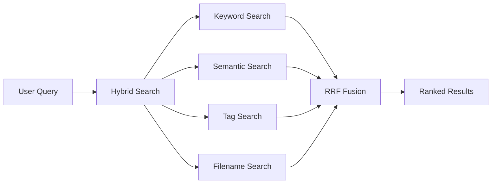

## Overview

Athena's Vector RAG system provides semantic search across your entire knowledge base using **gemini-embedding-001** (3,072 dimensions) and **Supabase pgvector** for storage. The system uses **Reciprocal Rank Fusion (RRF)** to combine multiple search strategies for optimal retrieval.

## Architecture



### Search Strategies

Athena combines multiple retrieval strategies using RRF:

1. **Canonical Memory** — Direct lookup in `CANONICAL.md`
2. **Tag Index** — Hashtag-based retrieval from `TAG_INDEX.md`
3. **Vector Similarity** — Cosine similarity in pgvector
4. **GraphRAG** — Entity-relationship traversal (deprecated)
5. **SQLite FTS** — Full-text search for keywords
6. **Filename Matching** — Fuzzy matching on file paths

## Vector Storage

### Collections

Athena indexes 11 knowledge domains in Supabase:

| Collection | Content Type | RPC Function |
|-----------|--------------|---------------|
| `sessions` | Session logs | `search_sessions` |
| `case_studies` | Documented patterns | `search_case_studies` |
| `protocols` | Skill protocols | `search_protocols` |
| `capabilities` | Bionic Triple Crown | `search_capabilities` |
| `playbooks` | Runbooks and workflows | `search_playbooks` |
| `references` | External frameworks | `search_references` |
| `frameworks` | Decision models | `search_frameworks` |
| `workflows` | Slash commands | `search_workflows` |
| `entities` | Knowledge graph nodes | `search_entities` |
| `user_profile` | User context | `search_user_profile` |
| `system_docs` | Architecture docs | `search_system_docs` |

### Embedding Generation

Embeddings are generated using Google's Gemini API with persistent disk caching:

```python
from athena.memory.vectors import get_embedding

# Generate embedding (cached automatically)
embedding = get_embedding("What are my trading risk limits?")
# Returns: List[float] with 3,072 dimensions
```

**Caching Strategy:**

- MD5 hash of input text as cache key
- JSON-backed persistent cache in `.agent/state/embedding_cache.json`
- Thread-safe atomic writes with background saving
- Prevents redundant API calls for repeated queries

<Note>
The embedding cache uses atomic file operations to prevent corruption during concurrent access.
</Note>

## Thread Safety

Version 1.2 introduced thread-safe optimizations for parallel search:

### Thread-Local Clients

```python
import threading

_thread_local = threading.local()

def get_client():
    """Returns a thread-safe Supabase client instance."""
    if not hasattr(_thread_local, "client"):
        from supabase import create_client
        _thread_local.client = create_client(url, key)
    return _thread_local.client
```

Each thread maintains its own Supabase client to prevent httpx connection state corruption.

### Atomic Cache Operations

```python
class PersistentEmbeddingCache:
    def __init__(self):
        self.lock = threading.Lock()
        self._cache = {}
        self._dirty = False
    
    def set(self, text_hash, embedding):
        with self.lock:
            self._cache[text_hash] = embedding
            self._dirty = True
        self._save()  # Background thread
```

Cache writes use:

1. **Lock-protected mutations** to prevent race conditions
2. **Atomic swap pattern** with `tempfile.mkstemp()` + `os.replace()`
3. **Background daemon threads** for non-blocking I/O

## Search Implementation

### Basic Vector Search

```python
from athena.memory.vectors import get_embedding, search_rpc

# Generate query embedding
query_embedding = get_embedding("trading protocols")

# Search protocols collection
results = search_rpc(
    rpc_name="search_protocols",
    query_embedding=query_embedding,
    limit=5,
    threshold=0.3  # Minimum similarity
)
```

### Collection-Specific Wrappers

```python
from athena.memory.vectors import search_protocols, get_client

client = get_client()
embedding = get_embedding("risk management")

results = search_protocols(
    client=client,
    query_embedding=embedding,
    limit=5,
    threshold=0.3
)
```

## Hybrid Search with RRF

The `smart_search` tool combines all strategies using Reciprocal Rank Fusion:

```python
from athena.tools.search import run_search

run_search(
    query="trading risk protocols",
    limit=10,
    strict=True,   # Filter low-confidence results
    rerank=True    # Apply LLM-based reranking
)
```

**RRF Formula:**

```
RRF(d) = Σ (1 / (k + rank_i(d)))
```

Where `k = 60` (standard constant) and `rank_i(d)` is the rank of document `d` in retrieval system `i`.

## Data Residency Options

| Mode | Where Data Lives | Best For |
|------|------------------|----------|
| **Cloud** | Supabase (your project) | Cross-device access, collaboration |
| **Local** | Your machine only | Sensitive data, air-gapped environments |
| **Hybrid** | Local files + cloud embeddings | Best of both worlds |

<Warning>
In Cloud mode, **text chunks** are sent to Google Cloud for embedding generation and **vector embeddings** are stored in your Supabase project. Raw text is NOT stored in Supabase—only embeddings.
</Warning>

### Local Mode

For sensitive data that shouldn't leave your machine:

```bash
# Use local vector store (ChromaDB or LanceDB)
export ATHENA_VECTOR_MODE=local
python -m athena.tools.index --local
```

See [Security](/advanced/security#data-residency) for more details.

## Database Schema

Each collection table uses the same schema:

```sql
CREATE TABLE protocols (
  id UUID PRIMARY KEY,
  content TEXT NOT NULL,
  embedding vector(3072),  -- pgvector type
  metadata JSONB,
  created_at TIMESTAMPTZ DEFAULT NOW()
);

-- Vector similarity search function
CREATE FUNCTION search_protocols(
  query_embedding vector(3072),
  match_threshold float,
  match_count int
)
RETURNS TABLE (...)
AS $$
  SELECT id, content, metadata,
    1 - (embedding <=> query_embedding) AS similarity
  FROM protocols
  WHERE 1 - (embedding <=> query_embedding) > match_threshold
  ORDER BY similarity DESC
  LIMIT match_count;
$$;
```

## Performance Optimizations

### 1. Embedding Cache

- **Hit Rate:** ~80% for repeated queries
- **Speedup:** 100x faster (no API call)
- **Storage:** JSON file, typically less than 5MB

### 2. Thread-Local Clients

- Prevents connection pool exhaustion
- Enables safe parallel search across collections
- Fixes `httpx.ReadError` in concurrent loops

### 3. Background Cache Writes

- Non-blocking I/O via daemon threads
- Atomic swap prevents corruption
- Dirty flag reduces unnecessary writes

## Implementation Reference

See `src/athena/memory/vectors.py:119` for the `get_embedding` implementation and `src/athena/tools/search.py` for the hybrid search logic.

## Next Steps

<CardGroup cols={2}>
  <Card title="MCP Server" icon="server" href="/advanced/mcp-server">
    Expose search capabilities via MCP tools
  </Card>
  <Card title="Governance" icon="shield-check" href="/advanced/governance">
    Learn about Triple-Lock protocol and integrity checks
  </Card>
</CardGroup>