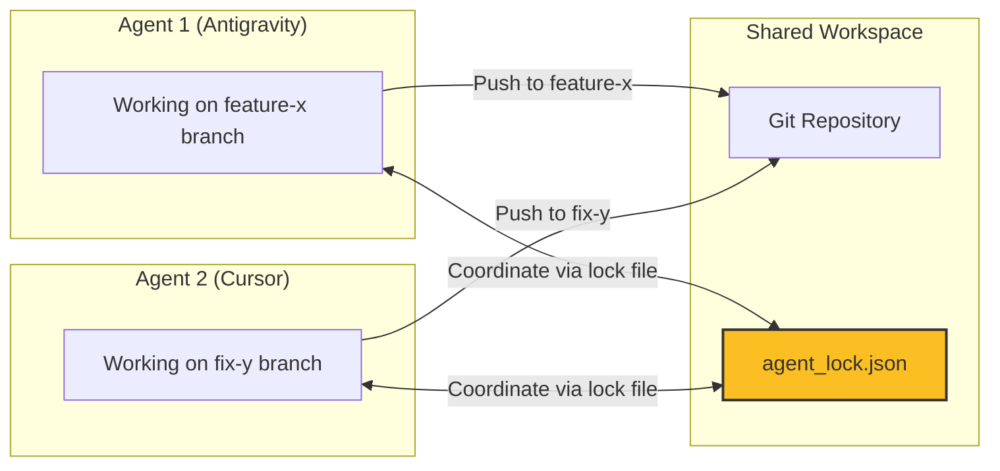

## Overview

Athena works with **any agent that reads Markdown**. For agents that support project-level config, `athena init` generates the native configuration file automatically.

<Info>
The beauty of Athena's architecture is that it's **IDE-agnostic**. The entire system is stored in Markdown files that any AI agent can read.
</Info>

## First-Class Integrations

<Tabs>
  <Tab title="Antigravity">
    **Config File**: `AGENTS.md`
    
    **Init Command**:
    ```bash
    athena init --ide antigravity
    ```
    
    **Features**:
    - Native `AGENTS.md` support
    - Multi-agent coordination
    - Full workspace access
    - Terminal execution
    
    **Recommended Settings**:
    - Non-workspace file access: `Enabled`
    - Terminal auto-execution: `Always Proceed`
    - Secure mode: `Disabled` (for trusted environments)
  </Tab>
  
  <Tab title="Cursor">
    **Config File**: `.cursor/rules.md`
    
    **Init Command**:
    ```bash
    athena init --ide cursor
    ```
    
    **Features**:
    - `.cursor/rules.md` integration
    - Composer support
    - Git integration
    - Multi-file editing
    
    **Recommended Settings**:
    - Enable `.cursor/rules.md`
    - Grant workspace permissions
    - Allow terminal commands
  </Tab>
  
  <Tab title="VS Code">
    **Config File**: `.vscode/settings.json`
    
    **Init Command**:
    ```bash
    athena init --ide vscode
    ```
    
    **Features**:
    - GitHub Copilot integration
    - Workspace context awareness
    - Extension support
    
    **Recommended Extensions**:
    - GitHub Copilot
    - Python extension
    - Markdown All in One
  </Tab>
  
  <Tab title="Gemini CLI">
    **Config File**: `.gemini/AGENTS.md`
    
    **Init Command**:
    ```bash
    athena init --ide gemini
    ```
    
    **Features**:
    - Direct Gemini API access
    - Command-line workflow
    - Lightweight integration
  </Tab>
  
  <Tab title="Kilo Code">
    **Config File**: `.kilocode/rules/athena.md`
    
    **Init Command**:
    ```bash
    athena init --ide kilocode
    ```
    
    **Features**:
    - Multi-agent support
    - Rules-based configuration
    - Project awareness
  </Tab>
  
  <Tab title="Roo Code">
    **Config File**: `.roo/rules/athena.md`
    
    **Init Command**:
    ```bash
    athena init --ide roocode
    ```
    
    **Features**:
    - Rules integration
    - Context management
    - Session persistence
  </Tab>
</Tabs>

## Generic Compatibility

Any AI agent that reads Markdown files from the project directory will work out of the box:

<CardGroup cols={2}>
  <Card title="Claude Code" icon="robot">
    Reads `CLAUDE.md` or `.claude/` directory
    
    **No init required** - Just create workspace
  </Card>
  
  <Card title="Windsurf" icon="wind">
    Reads project files directly
    
    **No init required** - Point at workspace
  </Card>
  
  <Card title="GitHub Copilot Chat" icon="github">
    Reads workspace files
    
    **No init required** - Works with VS Code
  </Card>
  
  <Card title="Local LLMs" icon="microchip">
    Any local model
    
    **Manual setup** - Point at `.framework/` and `.context/`
  </Card>
</CardGroup>

## How Init Works

When you run `athena init --ide <name>`, Athena creates:

<Steps>
  <Step title="Standard Workspace Structure">
    Creates `.agent/`, `.context/`, `.framework/` directories
  </Step>
  <Step title="IDE-Specific Config File">
    Generates the config file that tells the agent where to find Athena's memory, identity, and workflows
  </Step>
  <Step title="Boot Instructions">
    Adds references to `/start`, `/end`, `/save` workflows
  </Step>
  <Step title="Directory References">
    Links to key directories and files
  </Step>
  <Step title="Session Discipline">
    Includes session management guidelines
  </Step>
</Steps>

## Configuration File Contents

The IDE-specific config file is a Markdown document containing:

### Boot Instructions

```markdown
## Core Workflows

| Command | File | Purpose |
|:--------|:-----|:--------|
| `/start` | `.agent/workflows/start.md` | Boot the agent session |
| `/end` | `.agent/workflows/end.md` | Close session, file insights |
| `/save` | `.agent/workflows/save.md` | Mid-session checkpoint |
```

### Directory Map

```markdown
## Key Directories

- `.framework/` - Core identity and principles (stable)
- `.context/` - User-specific data (frequently updated)
- `.agent/` - Agent configuration (workflows, scripts, skills)
```

### Session Discipline

```markdown
## Session Discipline

1. **Always `/start`** - Load identity and context
2. **Always `/end`** - Commit insights to memory
3. **Checkpoint often** - Use `/save` before risky changes
4. **Load on-demand** - Don't load all files upfront
```

## Multi-Agent Support

<Warning>
**Protocol 413: Multi-Agent Coordination**

When running multiple AI agents on the same workspace:
- ❌ NEVER `git stash` (other agent's WIP lost)
- ❌ NEVER switch branches without explicit request
- ✅ ALWAYS `git pull --rebase` before pushing
- ✅ Commit only YOUR changed files
</Warning>

### Multi-Agent Safety



## Required Permissions

To achieve "Total Life OS" functionality, the IDE must have elevated permissions:

| Setting | Value | Purpose |
|---------|-------|---------|  
| **Non-Workspace File Access** | `Enabled` | Allows Athena to reach folders outside its root |
| **Terminal Auto Execution** | `Always Proceed` (optional) | Enables autonomous script execution |
| **Secure Mode** | `Disabled` | Removes friction for trusted environments |

<Note>
**Power vs. Safety**: An AI that manages your entire life *must* have access to your entire life. There is no way to sandbox an agent while simultaneously granting it full autonomy.

**Mitigation**:
1. **Quicksave** before dangerous operations
2. **Deny List** catastrophic commands (e.g., `rm -rf /`)
3. **Git Commit** on every `/end` session
</Note>

## Adding a New IDE

To add support for a new IDE:

<Steps>
  <Step title="Determine Config Location">
    Find where the IDE reads its agent rules from (e.g., `.cursor/rules.md`)
  </Step>
  <Step title="Add Template">
    Add a template constant to `src/athena/cli/init.py`
  </Step>
  <Step title="Add Handler">
    Create handler function in `src/athena/cli/init.py`
  </Step>
  <Step title="Register IDE">
    Add the IDE name to the `choices` list in `src/athena/__main__.py`
  </Step>
  <Step title="Test Init">
    Test `athena init --ide yourname` in clean directory
  </Step>
  <Step title="Submit PR">
    Submit pull request with new IDE support
  </Step>
</Steps>

### Example Implementation

```python
# In src/athena/cli/init.py

YOURIDE_TEMPLATE = """
# Athena Configuration for YourIDE

## Core Workflows

| Command | File | Purpose |
|:--------|:-----|:--------|
| `/start` | `.agent/workflows/start.md` | Boot the agent session |
| `/end` | `.agent/workflows/end.md` | Close session, file insights |

## Key Directories

- `.framework/` - Core identity (stable)
- `.context/` - User data (updated)
- `.agent/` - Configuration

## Session Discipline

1. Always `/start` to load identity
2. Always `/end` to commit insights
3. Use `/save` before risky changes
"""

def create_youride_config():
    config_path = Path(".youride/athena.md")
    config_path.parent.mkdir(exist_ok=True)
    config_path.write_text(YOURIDE_TEMPLATE)
    print(f"✓ Created {config_path}")
```

## Compatibility Matrix

| Feature | Antigravity | Cursor | VS Code | Gemini CLI | Generic |
|:--------|:----------:|:------:|:-------:|:----------:|:-------:|
| Auto-init | ✅ | ✅ | ✅ | ✅ | ⚠️ Manual |
| Workflow support | ✅ | ✅ | ⚠️ Partial | ✅ | ⚠️ Depends |
| Multi-agent | ✅ | ✅ | ❌ | ❌ | ❌ |
| Terminal execution | ✅ | ✅ | ✅ | ✅ | ⚠️ Depends |
| File access | ✅ | ✅ | ⚠️ Limited | ✅ | ⚠️ Depends |
| VectorRAG | ✅ | ✅ | ✅ | ✅ | ✅ |

**Legend**:
- ✅ Full support
- ⚠️ Partial/manual setup required
- ❌ Not supported

## Troubleshooting

<Accordion title="Agent doesn't see Athena files">
**Symptom**: Agent acts like generic AI, ignores workflows

**Solution**:
1. Check config file exists in correct location
2. Verify agent has workspace permissions
3. Manually reference `.framework/modules/Core_Identity.md`
4. Restart IDE/agent
</Accordion>

<Accordion title="Workflows not loading">
**Symptom**: `/start` doesn't work

**Solution**:
1. Verify `.agent/workflows/` directory exists
2. Check workflow files have correct frontmatter
3. Load workflow manually first time
4. Add workflow paths to agent config
</Accordion>

<Accordion title="Multi-agent conflicts">
**Symptom**: Git conflicts, lost changes

**Solution**:
1. Ensure Protocol 413 is loaded
2. Use separate branches per agent
3. Create `agent_lock.json` for coordination
4. Never use `git stash` with multiple agents
</Accordion>

<Accordion title="Permission denied errors">
**Symptom**: Can't access files outside workspace

**Solution**:
1. Enable non-workspace file access in IDE settings
2. Check mount points in `src/athena/boot/constants.py`
3. Verify filesystem permissions
4. Use relative paths when possible
</Accordion>

## Best Practices

<CardGroup cols={2}>
  <Card title="One Agent, One Branch" icon="code-branch">
    When using multiple agents, assign each to a dedicated branch to avoid conflicts.
  </Card>
  
  <Card title="Always Init First" icon="rocket">
    Run `athena init --ide <name>` before first use to ensure proper configuration.
  </Card>
  
  <Card title="Verify Permissions" icon="shield-check">
    Check IDE has necessary permissions before expecting advanced features.
  </Card>
  
  <Card title="Test in Isolation" icon="flask">
    Test new IDE integrations in a clean directory before using in production.
  </Card>
</CardGroup>

## Next Steps

<CardGroup cols={2}>
  <Card title="Getting Started" icon="play" href="/getting-started">
    Set up your first Athena workspace
  </Card>
  <Card title="Architecture" icon="building" href="/core-concepts/architecture">
    Understand the system design
  </Card>
  <Card title="Workflows" icon="workflow" href="/core-concepts/workflows">
    Learn about session management
  </Card>
</CardGroup>