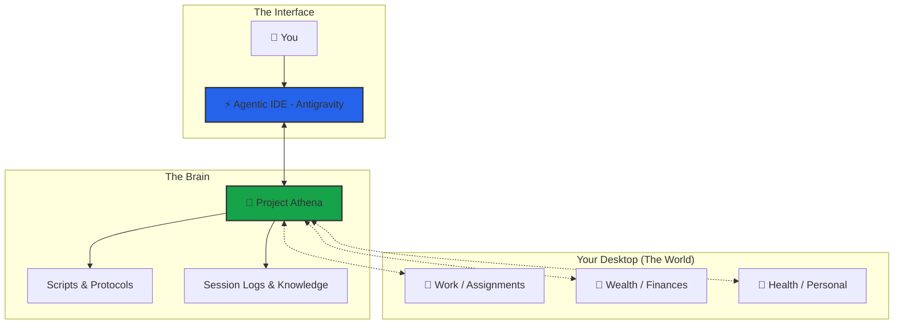
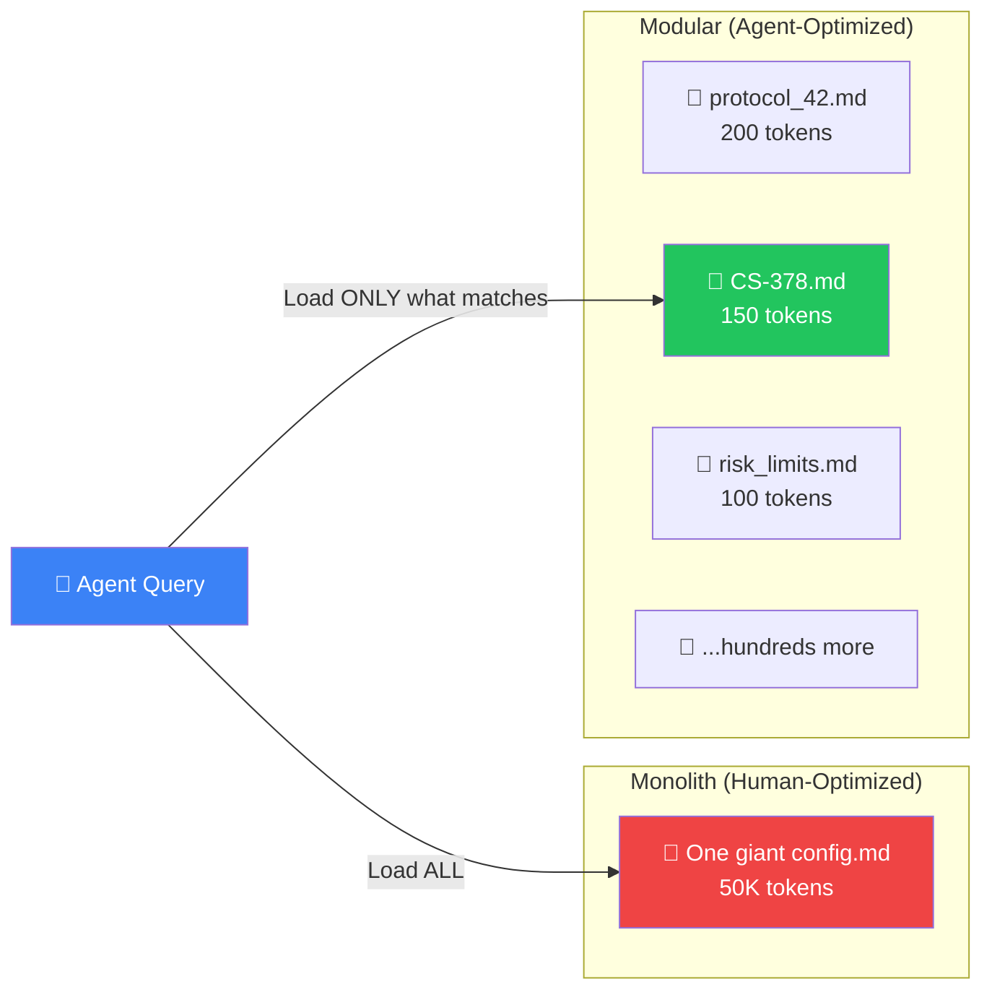
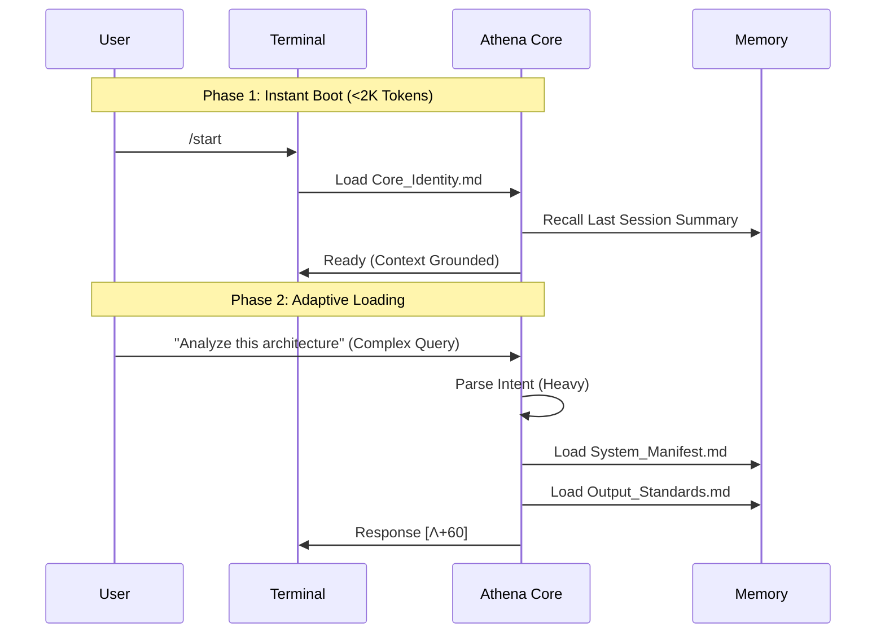
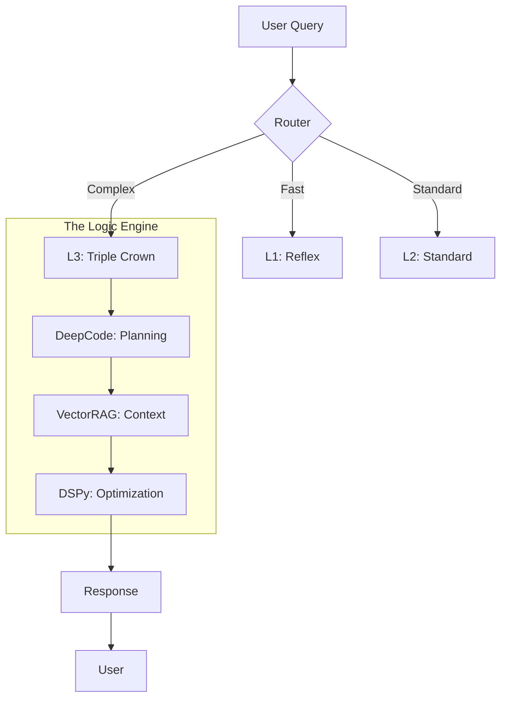

## The Exocortex Model

Athena is not just a coding assistant—it's a **Centralized HQ** for your entire life. Think of it as a "second brain" that manages external domains (Work, Wealth, Health) from a single command center.

<Info>
**Key Insight**: Athena deliberately fragments its knowledge across hundreds of Markdown files and Python scripts. This looks unusual to humans—but it is optimal for AI agents operating under context window constraints.
</Info>

### System Components



| Component | Role | Analogy |
|-----------|------|------|
| **Project Athena** | The Kernel — holds logic, memory, and laws | The Brain |
| **External Folders** | The Database — holds raw assets (files, docs) | The Body |
| **Agentic IDE** | The Console — provides compute and interface | The Nervous System |
| **You** | The Pilot — issues commands and makes decisions | The Consciousness |

## Directory Structure

```text
Athena/
├── .framework/                    # THE CODEX (stable, rarely updated)
│   ├── v8.6-stable/               # Current stable modules directory
│   │   ├── modules/
│   │   │   ├── Core_Identity.md   # Laws #0-#4, RSI, Bionic Stack, COS
│   │   │   └── Output_Standards.md # Response formatting, reasoning levels
│   │   └── protocols/             # Versioned protocol copies
│   ├── v7.0/                      # Previous stable version
│   └── archive/                   # Archived monoliths
│
├── .context/                      # USER-SPECIFIC DATA (frequently updated)
│   ├── User_Vault/                # Personal vault (credentials, secrets)
│   ├── memories/
│   │   ├── case_studies/          # 358+ documented patterns
│   │   ├── session_logs/          # Historical session analysis
│   │   └── patterns/              # Formalized patterns
│   ├── references/                # External frameworks (Dalio, Halbert, Graham)
│   ├── research/                  # Steal analyses, explorations
│   ├── TAG_INDEX_A-M.md           # Global hashtag system (split for performance)
│   ├── TAG_INDEX_N-Z.md
│   └── KNOWLEDGE_GRAPH.md         # Visual architecture reference
│
├── .agent/                        # AGENT CONFIGURATION
│   ├── skills/
│   │   ├── SKILL_INDEX.md         # Protocol loading registry
│   │   ├── protocols/             # 120+ modular skill files
│   │   │   ├── architecture/      # System protocols (latency, modularity)
│   │   │   ├── business/          # Business frameworks
│   │   │   ├── career/            # Career navigation
│   │   │   ├── decision/          # Decision frameworks
│   │   │   ├── psychology/        # Psych protocols
│   │   │   └── trading/           # Trading protocols
│   │   └── capabilities/          # Bionic Triple Crown
│   ├── workflows/                 # 48 slash commands
│   │   ├── start.md               # Session boot
│   │   ├── end.md                 # Session close + maintenance
│   │   ├── think.md               # Deep reasoning (L4)
│   │   └── ...
│   ├── scripts/                   # 130+ Python automation scripts
│   │   ├── quicksave.py           # Auto-checkpoint every exchange
│   │   ├── boot.py                # Resilient boot with recovery shell
│   │   ├── smart_search.py        # Semantic search
│   │   └── ...
│   └── gateway/                   # Sidecar process for persistence
```

## Design Philosophy: Modular > Monolith

<Accordion title="Why This Architecture Exists">
AI agents don't read files sequentially—they **query** them. A workspace optimized for agents should be a **graph of small, addressable nodes**, not a monolithic document.


</Accordion>

### The Five Advantages

| # | Principle | Monolith | Modular |
|:-:|:----------|:---------|:--------|
| 1 | **Context Efficiency** | Loads 50K tokens even when 200 are relevant | Loads only the files the query demands (JIT) |
| 2 | **Addressability** | "See page 47" — no agent can do this | `CS-378-prompt-arbitrage.md` — retrievable by name, tag, or semantic search |
| 3 | **Zero Coupling** | Editing marketing section risks breaking trading rules | Each file is independent — change one, break nothing |
| 4 | **Version Control** | One-line change → 50K-token diff | Atomic commits per file with clean history |
| 5 | **Composability** | Can't mix-and-match sections at runtime | Swarms, workflows, and skills load as independent Lego bricks |

## Loading Strategy



### On-Demand (Context-Triggered)

| Trigger | File Loaded | Tokens |
|---------|-------------|--------|
| User context query | `User_Profile_Core.md` | ~1,500 |
| Skill request | `SKILL_INDEX.md` | ~4,500 |
| `/think` invoked | `Output_Standards.md` | ~700 |
| Tag lookup | `TAG_INDEX.md` | ~5,500 |
| Architecture query | `System_Manifest.md` | ~1,900 |
| Specific protocol | `protocols/*.md` | varies |

<Note>
**`/start` boots at ~10K tokens** — only `Core_Identity.md`, `activeContext.md`, and session recall are loaded. The remaining 190K tokens of context window stay free.
</Note>

## The Bionic Stack



## Tech Stack

| Component | Technology |
|-----------|------------|
| **AI Engine** | Google Gemini (via Antigravity) |
| **IDE Integration** | VS Code / Cursor |
| **Knowledge Store** | Markdown + VectorRAG (Supabase + pgvector) |
| **Version Control** | Git |
| **Scripting** | Python 3.13 |

## Mount Points

To enable Athena to manage your life, you define **Mount Points**—aliases to external folders that exist *outside* the Athena directory:

```python
# In src/athena/boot/constants.py
MOUNTS = {
    "WORK": "/Users/you/Desktop/Assignments",
    "WEALTH": "/Users/you/Desktop/Wealth",
    "HEALTH": "/Users/you/Desktop/Health"
}
```

<Warning>
This is "God Mode". It is powerful but requires trust. Only enable in a personal, secure environment.
</Warning>

### Required IDE Settings

| Setting | Value | Purpose |
|---------|-------|---------|  
| **Non-Workspace File Access** | `Enabled` | Allows Athena to reach folders outside its root |
| **Terminal Auto Execution** | `Always Proceed` (optional) | Enables autonomous script execution |
| **Secure Mode** | `Disabled` | Removes friction for trusted environments |

## Key Files Reference

| Purpose | File | Update Frequency |
|---------|------|------------------|
| Who I am | `Core_Identity.md` | Rare |
| How to respond | `Output_Standards.md` | Moderate |
| Who the user is | `User_Profile.md` | Every session |
| What's forbidden | `Constraints_Master.md` | Rare |
| Architecture SSOT | `System_Manifest.md` | When architecture changes |
| Available skills | `SKILL_INDEX.md` | When skills added |
| Session history | `session_logs/*.md` | Every session |

## Next Steps

<CardGroup cols={2}>
  <Card title="Memory System" icon="brain" href="/core-concepts/memory-system">
    Learn how Athena maintains persistent memory across sessions
  </Card>
  <Card title="Workflows" icon="workflow" href="/core-concepts/workflows">
    Explore slash commands and automation
  </Card>
  <Card title="Protocols" icon="book" href="/core-concepts/protocols">
    Understand reusable thinking patterns
  </Card>
  <Card title="Agent Compatibility" icon="plug" href="/core-concepts/agent-compatibility">
    Configure Athena for your IDE
  </Card>
</CardGroup>