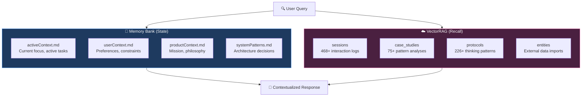
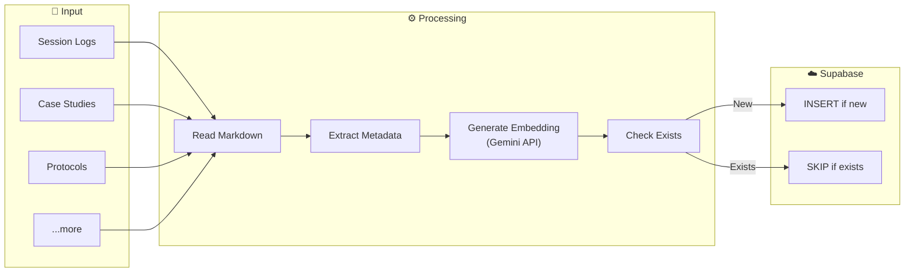
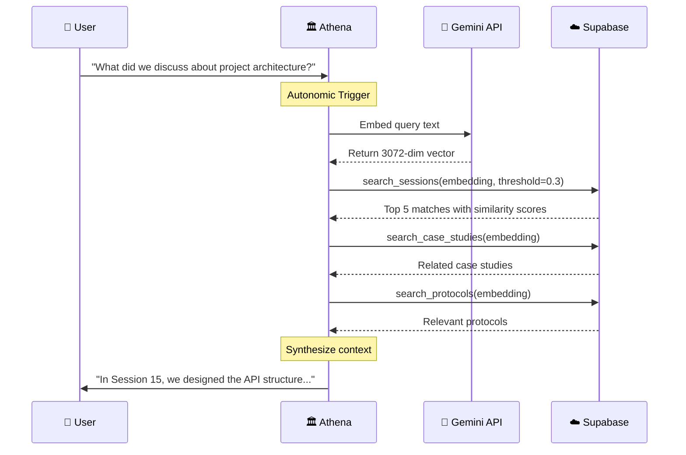
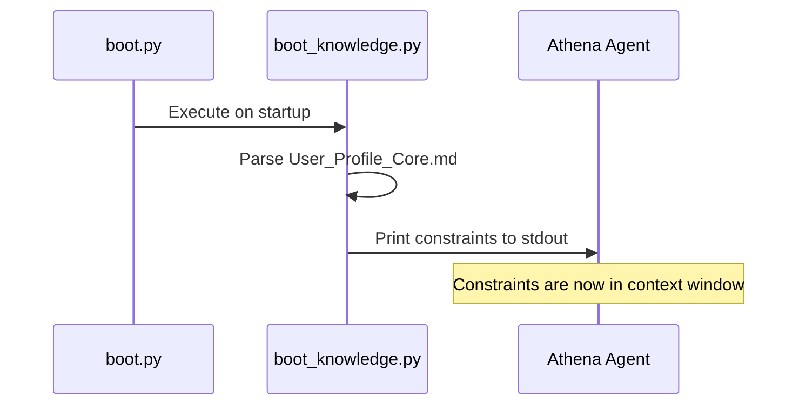

## Overview

Athena's memory system combines **structured state** (Memory Bank) with **semantic recall** (VectorRAG) to create a compound learning loop where each session starts smarter than the last.

<Info>
Think of it as the difference between:
- **Vector DB**: "Where did I see something about X?" (search)
- **Memory Bank**: "What am I working on right now?" (state)

You need both.
</Info>

## The Two-Layer Architecture



## Memory Bank: The 4 Pillars

### Core Files

| File | Purpose | Update Frequency |
|------|---------|------------------|
| `activeContext.md` | Current focus, active tasks, recent decisions | Every session |
| `userContext.md` | User profile, preferences, constraints | When preferences change |
| `productContext.md` | Product philosophy, goals, positioning | When strategy changes |
| `systemPatterns.md` | Architecture decisions, patterns, tech debt | When architecture evolves |

### How It Works

<Steps>
  <Step title="Session Start">
    The boot script loads all 4 Memory Bank files into context (~10K tokens)
  </Step>
  <Step title="During Session">
    The AI references Memory Bank state for continuity
  </Step>
  <Step title="Session End">
    The shutdown script updates `activeContext.md` with session outcomes
  </Step>
</Steps>

### Token Efficiency: The 15K Hard Cap

Boot tokens are budgeted with a strict ceiling:

| Slot | Budget | Growth Rate |
|------|--------|-------------|
| `userContext.md` | ~3K | Near-zero (identity is stable) |
| `productContext.md` | ~2K | Near-zero (mission is stable) |
| `activeContext.md` | ~5K | Rolling (compacts automatically) |
| Boot script output | ~2K | Fixed |
| System instructions | ~3K | Fixed |
| **Total** | **~15K max** | |

<Note>
When the total exceeds 15K tokens, `activeContext.md` auto-compacts—merging older session summaries into shorter entries until the budget is back under 10K.
</Note>

### The Operating Band

```
0K ██████████░░░░░ 15K
   ↑ ~10K target    ↑ hard cap (auto-compact triggers here)
```

Assuming 200K effective context length (the industry standard for SOTA models in 2026):

| Mode | Boot Cost | Workspace Left |
|------|-----------|----------------|
| `/start` (default) | ~10K | **190K** (95% free) |
| `/think` | ~15K | **185K** |
| `/ultrathink` | ~40K | **160K** |

### Progressive Distillation

Most "memory" solutions dump growing chat history into context. Athena keeps boot cost flat through **progressive distillation**:

```
Live conversation (100% fidelity)
  → Session log (~15% — key insights only)
    → activeContext.md entry (~5% — compressed summary)
      → Eventually compacted out (~0.1% — absorbed into userContext.md)
```

## VectorRAG: Semantic Memory

### Architecture



### Technology Stack

| Component | Technology | Purpose |
|:----------|:-----------|:--------|
| **Vector Database** | Supabase + pgvector | Cloud-native, persistent storage |
| **Embeddings** | Google `text-embedding-004` | 3072-dimension semantic vectors |
| **Similarity** | Cosine Distance (`<=>`) | Meaning-based matching |
| **Sync** | Python Scripts | Automated indexing pipeline |

### The 11 Searchable Domains

<Tabs>
  <Tab title="Memory">
    - **sessions** (~468): Daily interaction logs
    - **case_studies** (~75): Pattern analysis documents
    - **entities** (~100 chunks): External data imports
  </Tab>
  <Tab title="Skills">
    - **protocols** (~226): Reusable thinking patterns
    - **capabilities** (~10): Tool/skill definitions
    - **playbooks** (~5): Strategic guides
  </Tab>
  <Tab title="Reference">
    - **frameworks** (~5): Core Identity modules
    - **references** (~10): External citations
    - **workflows** (~20): Automation scripts
    - **user_profile** (~10): Preferences, settings
    - **system_docs** (~10): TAG_INDEX, manifests
  </Tab>
</Tabs>

**Total Indexed Documents**: ~850+

### How Semantic Search Works



### Similarity Scoring

| Similarity Score | Interpretation |
|:-----------------|:---------------|
| **> 0.7** | Highly relevant |
| **0.5 - 0.7** | Moderately relevant |
| **0.3 - 0.5** | Loosely related |
| **< 0.3** | Likely noise |

## Memory Bank vs. VectorRAG

<Accordion title="When to Use Each">
| Need | Use |
|------|-----|
| "What am I working on?" | Memory Bank (`activeContext.md`) |
| "What did I say about X 3 weeks ago?" | Vector search (`smart_search.py`) |
| "What's my risk tolerance?" | Memory Bank (`userContext.md`) |
| "Find sessions about authentication" | Vector search |
</Accordion>

## Context Hydration

<Warning>
**Problem**: Learnings written to files (e.g., `User_Profile_Core.md`) become *passive documentation*. The AI doesn't read them unless explicitly prompted, causing the same mistakes to repeat.
</Warning>

**Solution**: **Active Injection** — Force-feed critical constraints into the terminal during boot.



**Key Scripts:**

- `boot_knowledge.py`: Extracts and prints constraints
- `index_workspace.py`: Rebuilds `TAG_INDEX.md` and `PROTOCOL_SUMMARIES.md` on shutdown

## Real-World Example

### Scenario: Business Deal Advice

**Query**: *"Should I accept this commission-based partnership where the agent takes no risk?"*

<Tabs>
  <Tab title="Generic AI (No Memory)">
    **Output**: "Commission-based partnerships can be effective for motivation. Ensure you have clear contracts. Pros include low fixed costs, while cons include potential short-term focus by the agent."
    
    **Verdict**: Safe but generic. Balanced pros/cons list but lacks strategic conviction.
  </Tab>
  <Tab title="Athena (With VectorRAG)">
    **Retrieval**:
    - `Protocol 33: Principal-Agent Problem` (Theory)
    - `CS044_ILP_Trust_Arbitrage` (Similar bad deal case study)
    - `Protocol 121: Amoral Realism` (Framework)
    
    **Output**: "Stop. This structure matches the **Principal-Agent Problem** we analyzed in the **ILP Trust Arbitrage Case (CS044)**. The counterparty has **zero downside risk** while you bear all liability. This mirrors the 'Tuition Trap' mechanic we identified in Dec 2024. **Recommendation**: Reject the deal unless they accept a clawback clause (shared risk) per Protocol 33."
    
    **Verdict**: Contextualized & decisive. Uses past organizational memory to prevent recurring errors.
  </Tab>
</Tabs>

## Autonomic Behaviors

| Protocol | Trigger | Action |
|----------|---------|--------|
| **Quicksave** | Every user exchange | `quicksave.py` → checkpoint to session log |
| **Intent Persistence** | Significant logical change | `TASK_LOG.md` → document the "WHY" behind code changes |
| **Auto-Documentation** | Pattern detected | File to appropriate location |
| **Orphan Detection** | On `/end` | `orphan_detector.py` → link or alert |

## Cost Analysis

| Resource | Free Tier | Paid Tier |
|:---------|:----------|:----------|
| **Supabase** | 500MB DB, 2GB bandwidth | $25/mo for 8GB |
| **Gemini Embeddings** | 1,500 req/day | N/A (no cost beyond free) |
| **Total** | **$0/month** | ~$25/month at scale |

<Tip>
At ~730 documents, we're well within free tier limits. Embeddings are generated once per document, so ongoing costs are minimal.
</Tip>

## Next Steps

<CardGroup cols={2}>
  <Card title="Architecture" icon="building" href="/core-concepts/architecture">
    Understand the overall system design
  </Card>
  <Card title="Workflows" icon="workflow" href="/core-concepts/workflows">
    Learn about session management and automation
  </Card>
</CardGroup>