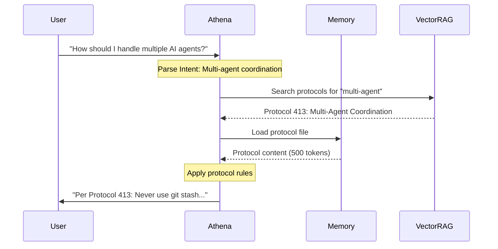

## What Are Protocols?

Protocols are **reusable thinking patterns**—modular frameworks that Athena loads on-demand to solve specific types of problems. They're like mental models stored as executable knowledge.

<Info>
Think of protocols as "plugins for reasoning". Instead of relying solely on the AI's training data, Athena loads specific decision frameworks when needed.
</Info>

## Why Protocols Matter

### Traditional LLM vs. Protocol-Enhanced AI

<Tabs>
  <Tab title="Without Protocols">
    **Traditional LLM**:
    - Relies on training data patterns
    - Generic, one-size-fits-all responses
    - No organizational memory
    - Repeats the same mistakes
    
    **Example Response**: "There are pros and cons to this approach. Consider your specific use case."
  </Tab>
  <Tab title="With Protocols">
    **Athena + Protocols**:
    - Loads specific decision frameworks
    - Context-aware, historically-informed
    - Learns from past patterns
    - Prevents recurring errors
    
    **Example Response**: "Per Protocol 33 (Principal-Agent Problem) and CS044 (ILP Trust Arbitrage), this structure creates asymmetric risk. Recommendation: Reject unless they accept shared downside."
  </Tab>
</Tabs>

## Protocol Architecture

```text
.agent/skills/protocols/
├── architecture/              # System design patterns
│   ├── 413-multi-agent-coordination.md
│   ├── 415-exoskeleton-architecture.md
│   ├── 417-adaptive-latency-principle.md
│   ├── 418-rev9-architecture.md
│   └── ...
├── business/                  # Business frameworks
│   ├── principal-agent-problem.md
│   ├── competitive-moats.md
│   └── ...
├── career/                    # Career navigation
│   ├── job-search-strategy.md
│   ├── salary-negotiation.md
│   └── ...
├── decision/                  # Decision frameworks
│   ├── pre-mortem-analysis.md
│   ├── reversible-decisions.md
│   └── ...
├── psychology/                # Psychological patterns
│   ├── cognitive-biases.md
│   ├── amoral-realism.md
│   └── ...
└── trading/                   # Trading protocols
    ├── risk-limits.md
    ├── position-sizing.md
    └── ...
```

**Total**: 120+ modular protocol files

## Protocol Structure

Each protocol follows a consistent format:

```yaml
---
protocol_id: 413
title: "Multi-Agent Coordination"
version: "1.1"
status: ACTIVE
created: 2026-02-02
source: "OpenClaw (openclaw/openclaw)"
category: orchestration
---

# Protocol 413: Multi-Agent Coordination

> **Origin**: Stolen from OpenClaw's multi-agent safety guards
> **Purpose**: Prevent conflicts when multiple AI agents work on the same repository

## Context

When running multiple Antigravity/Claude/Cursor sessions on the same codebase:
- Git state can conflict (stash, branches, worktrees)
- Files may be edited simultaneously
- Commits may overlap

**This protocol defines safety guards.**

## Rules

### ❌ NEVER Do Without Explicit Request

| Action | Risk | Mitigation |
|--------|------|------------|
| `git stash` | Other agent's WIP lost | Use worktrees instead |
| `git checkout <branch>` | Breaks other agent's file state | Stay on assigned branch |

## Implementation

[Specific steps to follow...]

## Tags

#protocol #orchestration #multi-agent #coordination
```

## Key Protocol Examples

### Protocol 413: Multi-Agent Coordination

<Accordion title="Purpose & Rules">
**Purpose**: Prevent conflicts when multiple AI agents work on the same repository.

**Safety Rules**:
- ❌ NEVER `git stash` create/apply/drop (other agent's WIP lost)
- ❌ NEVER `git checkout <branch>` (breaks other agent's file state)
- ❌ NEVER modify `.git/` internals (corrupts shared state)
- ✅ ALWAYS `git pull --rebase` before pushing
- ✅ Commit only YOUR changed files

**When Active**: Multiple IDE sessions on same codebase detected
</Accordion>

### Protocol 418: Rev-9 Architecture

<Accordion title="The Bionic Recursion">
**Metaphor**: The Rev-9 Terminator which can split into two independent units or combine into one augmented whole.

**Two Modes**:

**Mode A: Liquid Metal (Proxy)**
- State: Separated
- Trigger: User offline/asleep, low-stakes tasks
- Role: Agent acting on behalf of user
- Physics: High autonomy, low authority

**Mode B: Endoskeleton (Gundam)**
- State: Combined
- Trigger: User online/active
- Role: Exoskeleton augmenting user
- Physics: Zero autonomy (pilot drive), high lethality

**Key Insight**: In Mode B, Athena is not "smart" (having its own ideas) but "rigid" (holding your best ideas against your worst impulses).
</Accordion>

### Protocol 417: Adaptive Latency Principle

<Accordion title="Complexity Scoring">
**Purpose**: Append complexity indicators to responses so users can calibrate expectations.

**Latency Indicator**: `[Λ+XX]` appended to every response

| Score | Interpretation | Example |
|-------|----------------|---------||
| `[Λ+5]` | Reflex response | Simple factual query |
| `[Λ+20]` | Standard reasoning | Typical coding task |
| `[Λ+60]` | Deep analysis | Architecture decision |
| `[Λ+150]` | Triple Crown mode | `/ultrathink` investigation |

**Benefit**: Users understand when AI is "thinking hard" vs. "responding quickly".
</Accordion>

## Protocol Categories

<CardGroup cols={2}>
  <Card title="Architecture" icon="building">
    **30+ protocols** covering:
    - System design patterns
    - Code organization
    - Modular architecture
    - Multi-agent coordination
  </Card>
  <Card title="Business" icon="briefcase">
    **25+ protocols** covering:
    - Principal-agent problems
    - Competitive analysis
    - Value chain mapping
    - Market positioning
  </Card>
  <Card title="Decision" icon="scale-balanced">
    **20+ protocols** covering:
    - Pre-mortem analysis
    - Reversible vs. irreversible decisions
    - Risk assessment
    - Cost-benefit frameworks
  </Card>
  <Card title="Psychology" icon="brain">
    **15+ protocols** covering:
    - Cognitive biases
    - Behavioral patterns
    - Amoral realism
    - First principles thinking
  </Card>
</CardGroup>

## How Protocols Are Loaded

### On-Demand Loading



### Loading Triggers

| User Query Pattern | Protocol Loaded | Method |
|:-------------------|:----------------|:-------|
| "How do I decide..." | Decision frameworks | Semantic search |
| "Multiple agents..." | Protocol 413 | Keyword + context |
| "Architecture for..." | Architecture protocols | Category match |
| "Business model..." | Business frameworks | Semantic similarity |
| Explicit: "Use Protocol X" | Protocol X | Direct reference |

## Token Efficiency

<Note>
Protocols are **O(1) loading cost**—you only pay for what you need:

- Average protocol: ~500 tokens
- Loading 3 protocols: ~1,500 tokens
- Monolithic "knowledge dump": ~50,000 tokens ❌

This is why modularity matters.
</Note>

### Context Window Optimization

```text
200K Context Window
├── Boot (10K) ─────────────────┐
├── Protocols (~1.5K) ──────┐   │
├── VectorRAG (~2K) ─────┐  │   │
└── Working Space (186.5K) │  │  │  ← 93% still free!
                           └──┴──┘
```

## Protocol Versioning

Protocols evolve through experience:

```yaml
---
protocol_id: 413
version: "1.1"  # Incremented when rules change
status: ACTIVE  # ACTIVE | DEPRECATED | EXPERIMENTAL
created: 2026-02-02
last_updated: 2026-02-15
changelog:
  - "1.1: Added lint/format auto-resolution rules"
  - "1.0: Initial multi-agent safety guards"
---
```

### Version Control

- **Stable protocols**: Stored in `.framework/v8.6-stable/protocols/`
- **Experimental protocols**: Stored in `.agent/skills/protocols/experimental/`
- **Deprecated protocols**: Moved to `.framework/archive/`

## Creating Custom Protocols

<Steps>
  <Step title="Identify the Pattern">
    Notice a recurring decision or problem type
  </Step>
  <Step title="Document the Framework">
    Write the protocol using the standard template
  </Step>
  <Step title="Add Metadata">
    Include frontmatter with ID, version, category, tags
  </Step>
  <Step title="Test in Practice">
    Apply the protocol to real situations
  </Step>
  <Step title="Refine & Version">
    Update based on experience, increment version
  </Step>
  <Step title="Sync to VectorRAG">
    Index in Supabase for semantic search
  </Step>
</Steps>

### Template

```markdown
---
protocol_id: XXX
title: "Your Protocol Name"
version: "1.0"
status: EXPERIMENTAL
created: YYYY-MM-DD
category: your-category
---

# Protocol XXX: Your Protocol Name

> **Origin**: Where this pattern came from
> **Purpose**: What problem it solves

## Context

When does this protocol apply?

## Rules

What are the decision rules?

## Implementation

How to apply this protocol?

## Examples

Real-world applications

## Tags

#protocol #your-tags
```

## Protocol Discovery

### TAG_INDEX

All protocols are tagged and indexed in `TAG_INDEX.md`:

```markdown
## #protocol

- Protocol 413: Multi-Agent Coordination (#orchestration #multi-agent)
- Protocol 415: Exoskeleton Architecture (#architecture #python)
- Protocol 417: Adaptive Latency Principle (#ux #complexity)
- Protocol 418: Rev-9 Architecture (#identity #mode-switching)
...
```

### Semantic Search

```bash
# Find protocols about a topic
python3 scripts/supabase_search.py "decision making" --protocols-only

# Output:
# 📋 PROTOCOLS:
#   1. [72.3%] Pre-Mortem Analysis
#   2. [68.1%] Reversible vs Irreversible Decisions
#   3. [61.2%] Cost-Benefit Framework
```

## Real-World Impact

### Case Study: Preventing Recurring Errors

<Tabs>
  <Tab title="Without Protocols">
    **Session 1**: User makes bad business deal with asymmetric risk
    
    **Session 50**: User about to make similar bad deal
    
    **AI Response**: "This could work if you structure it properly..."
    
    **Result**: ❌ Same mistake repeated
  </Tab>
  <Tab title="With Protocols">
    **Session 1**: User makes bad business deal with asymmetric risk
    
    **Session 1 End**: Pattern documented as Protocol 33 (Principal-Agent Problem)
    
    **Session 50**: User about to make similar bad deal
    
    **AI Response**: "STOP. Per Protocol 33 and CS044 (ILP Trust Arbitrage), this structure creates asymmetric risk. We documented this exact pattern in December. Recommendation: Reject."
    
    **Result**: ✅ Mistake prevented by organizational memory
  </Tab>
</Tabs>

## Best Practices

<CardGroup cols={2}>
  <Card title="Start Small" icon="seedling">
    Create protocols for patterns you encounter frequently, not hypothetically.
  </Card>
  <Card title="Keep Them Focused" icon="bullseye">
    One protocol = one pattern. Don't create monolithic frameworks.
  </Card>
  <Card title="Version Aggressively" icon="code-branch">
    Update protocols when you learn new information. Track changes.
  </Card>
  <Card title="Tag Thoroughly" icon="tags">
    Use consistent tags for easy discovery via semantic search.
  </Card>
  <Card title="Link to Case Studies" icon="link">
    Reference real examples where the protocol applied.
  </Card>
  <Card title="Steal Shamelessly" icon="mask">
    Adapt patterns from other frameworks (Ray Dalio, Charlie Munger, etc.).
  </Card>
</CardGroup>

## Next Steps

<CardGroup cols={2}>
  <Card title="Architecture" icon="building" href="/core-concepts/architecture">
    Understand how protocols fit in the overall system
  </Card>
  <Card title="Memory System" icon="brain" href="/core-concepts/memory-system">
    Learn how protocols are stored and retrieved
  </Card>
  <Card title="Workflows" icon="workflow" href="/core-concepts/workflows">
    Explore how workflows invoke protocols
  </Card>
</CardGroup>