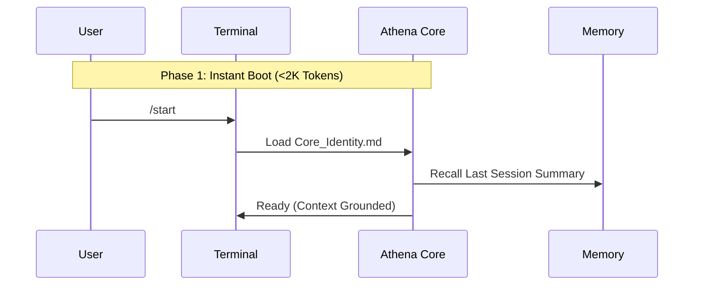
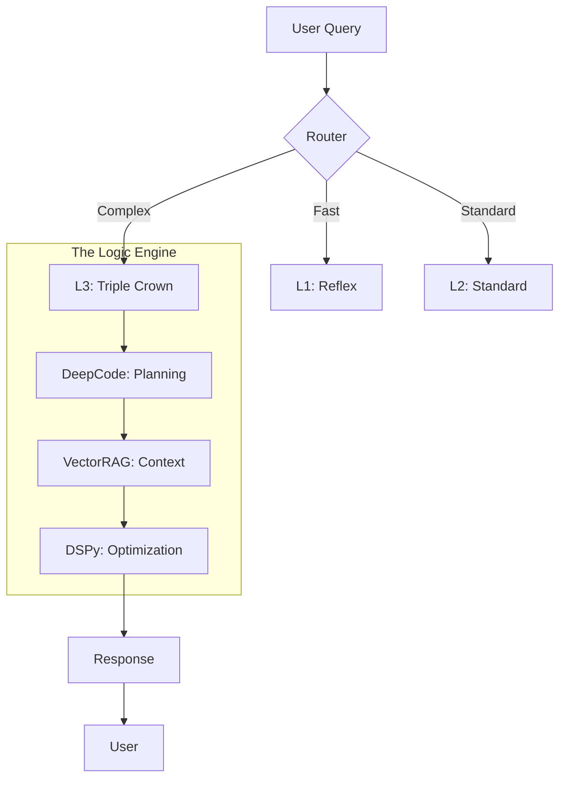

## Overview

Workflows are slash commands that trigger predefined sequences of actions. They're the backbone of Athena's session management and deep reasoning capabilities.

<Info>
Workflows live in `.agent/workflows/` as Markdown files. Each workflow is a reusable pattern that can be invoked with a simple slash command.
</Info>

## Quick Reference

<Tabs>
  <Tab title="Session Management">
    | Command | Purpose | Complexity |
    |---------|---------|------------|
    | `/start` | Boot session, load identity | Low |
    | `/end` | Close session, commit to memory | Low |
    | `/tutorial` | Guided first-session walkthrough | Low |
    | `/save` | Mid-session checkpoint | Low |
  </Tab>
  <Tab title="Reasoning">
    | Command | Purpose | Complexity |
    |---------|---------|------------|
    | `/think` | Deep reasoning (all phases) | Medium |
    | `/ultrathink` | Maximum depth (parallel orchestrator) | High |
    | `/plan` | Structured planning with pre-mortem | Medium |
    | `/brief` | Pre-prompt clarification protocol | Medium |
  </Tab>
  <Tab title="Research">
    | Command | Purpose | Complexity |
    |---------|---------|------------|
    | `/search` | Web search with citations | Medium |
    | `/research` | Exhaustive multi-source investigation | High |
  </Tab>
  <Tab title="Maintenance">
    | Command | Purpose | Complexity |
    |---------|---------|------------|
    | `/refactor` | Full workspace optimization | High |
    | `/vibe` | Ship at 70%, iterate fast | Low |
    | `/deploy` | Sanitized public repo sync | Medium |
  </Tab>
</Tabs>

## Session Management

### `/start` - Boot Sequence

**Purpose**: Beginning of every session. Loads identity, recalls context from previous sessions.



<Accordion title="What Happens During Boot">
1. Load `Core_Identity.md` (~8K tokens)
2. Load Memory Bank files (~10K tokens total)
3. Recall last session summary
4. Initialize session log
5. Print active context and current mandates
</Accordion>

### `/end` - Session Close

**Purpose**: End of every session. Commits insights to memory, updates indexes.

<Steps>
  <Step title="Finalize Session Log">
    Write key decisions and insights to session log file
  </Step>
  <Step title="Update Memory Bank">
    Update `activeContext.md` with session outcomes
  </Step>
  <Step title="Harvest Check">
    Scan for reusable patterns worth documenting
  </Step>
  <Step title="Rebuild Indexes">
    Regenerate `TAG_INDEX.md` and `PROTOCOL_SUMMARIES.md`
  </Step>
  <Step title="Git Commit">
    Commit session changes to version control
  </Step>
</Steps>

### `/save` - Mid-Session Checkpoint

**When to Use**: Mid-session when you want to checkpoint without closing. Use before risky experiments.

<Warning>
Always checkpoint before:
- Destructive operations
- Large refactors
- Experimental changes
- Architecture modifications
</Warning>

## Reasoning Workflows

### Depth Comparison

| Workflow | Depth | Token Budget | Use Case |
|----------|-------|--------------|----------|
| **Normal** | Standard | ~500 tokens | Most queries |
| **`/think`** | High | ~2000 tokens | Important decisions, complex problems |
| **`/ultrathink`** | Maximum | ~5000+ tokens | Life-altering decisions, multi-stakeholder analysis |

<Note>
**Rule**: Default to normal mode. Escalate to `/think` for $10K+ decisions. Use `/ultrathink` only for maximum-depth analysis.
</Note>

### `/think` - Deep Reasoning



**Phases**:
1. **Context Loading**: Pull relevant protocols and case studies
2. **Deep Analysis**: Multi-perspective reasoning
3. **Synthesis**: Structured recommendations
4. **Quality Check**: Verify against constraints

### `/ultrathink` - Maximum Depth

**When to Use**: Maximum-depth analysis for critical decisions.

<Accordion title="Triple Crown Mode">
Combine `/think /search /research` for nuclear-level investigation:

- **DeepCode**: Planning and structured analysis
- **VectorRAG**: Historical context from 850+ documents
- **DSPy**: Optimized reasoning chains
- **Web Search**: Real-time external validation
- **Multi-Source Research**: Exhaustive investigation
</Accordion>

## Planning Workflows

### `/brief` - Pre-Prompt Clarification

**Purpose**: Clarify requirements before complex tasks to reduce wasted tokens.

**Variants**:
- `/brief` — Core brief (default)
- `/brief ++` — Expanded fields for complex work
- `/brief build` — Technical implementation tasks
- `/brief research` — Investigation/analysis tasks
- `/brief interview` — Iterative Q&A to extract requirements

**Example**:
```
/brief build a dashboard for tracking trading performance
```

### `/plan` - Structured Task Planning

**For "Heavy" tasks** (new features, refactors, architecture changes):

<Steps>
  <Step title="Enter PLANNING mode">
    Activate structured planning workflow
  </Step>
  <Step title="Generate implementation plan">
    Create detailed plan with pre-mortem analysis
  </Step>
  <Step title="Review with user">
    Present plan for approval before execution
  </Step>
  <Step title="Track progress">
    Maintain progress in `task.md`
  </Step>
</Steps>

## Research Workflows

### Search Depth Comparison

| Workflow | Searches | Sources Read | Depth |
|----------|----------|--------------|-------|
| **`/search`** | 2-3 | 0-2 | Medium |
| **`/research`** | 5-10+ | 3-10+ | Maximum |

### `/search` - Quick Web Search

**Purpose**: Fast web search with citations for fact-checking and current information.

**Output**:
- 2-3 search queries executed
- Top results summarized
- Citations included

### `/research` - Exhaustive Investigation

**Purpose**: Multi-source investigation for comprehensive analysis.

**Process**:
1. Generate 5-10 search queries
2. Read 3-10+ full sources
3. Cross-reference findings
4. Synthesize comprehensive report
5. Include full bibliography

## Maintenance Workflows

### `/refactor` - Full Workspace Optimization

**Purpose**: Maintain workspace integrity through periodic optimization.

**Phases**:

<Steps>
  <Step title="Diagnostics">
    Scan workspace for issues (orphans, broken links, duplicates)
  </Step>
  <Step title="Pre-remediation Checkpoint">
    Create backup before modifications
  </Step>
  <Step title="Fix Orphans & Broken Links">
    Repair or remove orphaned files and broken references
  </Step>
  <Step title="Optimization Pass">
    Consolidate duplicates, clean up tech debt
  </Step>
  <Step title="Supabase Sync">
    Re-index all documents in VectorRAG
  </Step>
  <Step title="Cache Refresh">
    Clear and rebuild internal caches
  </Step>
  <Step title="Index Regeneration">
    Rebuild TAG_INDEX and PROTOCOL_SUMMARIES
  </Step>
  <Step title="Commit">
    Commit all changes with detailed log
  </Step>
</Steps>

**Frequency**: Run monthly or after major architecture changes.

### `/vibe` - Vibe Coding Mode

**Philosophy**: Ship at 70% confidence, iterate based on feedback.

**Principles**:
- No over-engineering
- Rapid iteration
- User feedback drives refinement
- Progress over perfection

**SEO Checklist** (mandatory before deploy):
- [ ] Keyword in H1/Title
- [ ] Internal linking
- [ ] Descriptive URL slug
- [ ] Meta description

### `/deploy` - Public Repo Sync

**Purpose**: Sanitized public repository sync (removes private data).

**Safety Checks**:
1. Scan for credentials and secrets
2. Remove personal information
3. Clean sensitive paths
4. Validate public-safe content
5. Sync to public repo

## Creating Custom Workflows

Workflows live in `.agent/workflows/` as Markdown files:

```yaml
---
description: Short description for the workflow index
created: YYYY-MM-DD
last_updated: YYYY-MM-DD
---

# /command-name — Title

## Behavior

What happens when invoked...

## Phases

Step-by-step execution...

## Tagging

#workflow #automation
```

### Conventions

<Accordion title="Workflow File Structure">
- Use `// turbo` annotation above steps that are safe to auto-run
- Reference other workflows with relative links
- Include rollback instructions for destructive operations
- Add clear exit conditions
- Document expected token usage
</Accordion>

## Best Practices

<CardGroup cols={2}>
  <Card title="Choose the Right Depth" icon="gauge">
    Don't `/ultrathink` on simple queries. Reserve deep reasoning for important decisions.
  </Card>
  <Card title="Checkpoint Often" icon="floppy-disk">
    Use `/save` before risky experiments. Prevention beats recovery.
  </Card>
  <Card title="Brief First" icon="clipboard-question">
    For complex tasks, `/brief` reduces wasted tokens and improves output quality.
  </Card>
  <Card title="End Sessions Properly" icon="door-closed">
    `/end` commits insights to long-term memory. Never skip it.
  </Card>
  <Card title="Combine Strategically" icon="layer-group">
    `/think /search /research` for maximum coverage on critical decisions.
  </Card>
  <Card title="Maintain Regularly" icon="broom">
    Run `/refactor` monthly to keep workspace healthy.
  </Card>
</CardGroup>

## Next Steps

<CardGroup cols={2}>
  <Card title="Architecture" icon="building" href="/core-concepts/architecture">
    Understand the overall system design
  </Card>
  <Card title="Memory System" icon="brain" href="/core-concepts/memory-system">
    Learn how memory persists across sessions
  </Card>
  <Card title="Protocols" icon="book" href="/core-concepts/protocols">
    Explore reusable thinking patterns
  </Card>
</CardGroup>